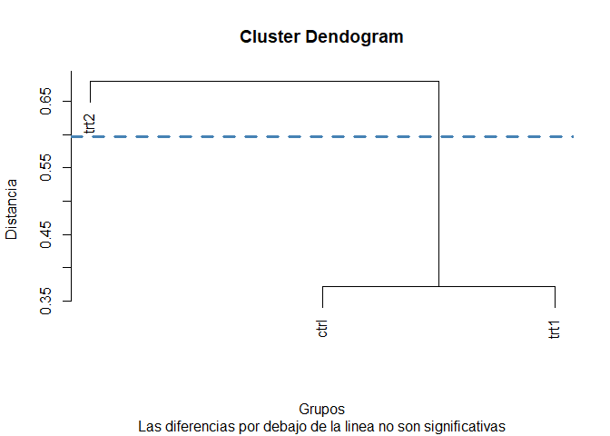

<!-- README.md is generated from README.Rmd. Please edit that file -->

# ClustMC

<!-- badges: start -->

[](https://github.com/SGS2000/ClustMC/actions/workflows/R-CMD-check.yaml)
[](https://codecov.io/gh/SGS2000/ClustMC)
[](https://lifecycle.r-lib.org/articles/stages.html#experimental)
<!-- badges: end -->

ClustMC implements cluster based multiple comparisons tests.

ClustMC implementa pruebas de comparaciones múltiples basadas en
conglomerados.

## Installation / Instalación

The package can be installed from GitHub: / El paquete puede instalarse
desde GitHub:

``` r
devtools::install_github("SGS2000/ClustMC")
```

## Examples / Ejemplos

The following example applies the Di Rienzo, Guzmán, and Casanoves Test
to evaluate whether there are significant differences between the yields
obtained under a control and two different treatment conditions.

El siguiente ejemplo aplica la Prueba de Di Rienzo, Guzmán y Casanoves
para evaluar si existen diferencias significativas entre los
rendimientos obtenidos bajo una condición de control y dos condiciones
de tratamiento diferentes.

``` r
library(ClustMC)

data(PlantGrowth)
plants_weights <- PlantGrowth$weight
plants_trt <- PlantGrowth$group

anova_model <- aov(plants_weights ~ plants_trt)

dgc_test(y = anova_model, trt = "plants_trt")
```



    #>      group
    #> ctrl     1
    #> trt1     1
    #> trt2     2
    #> Treatments within the same group are not significantly different
