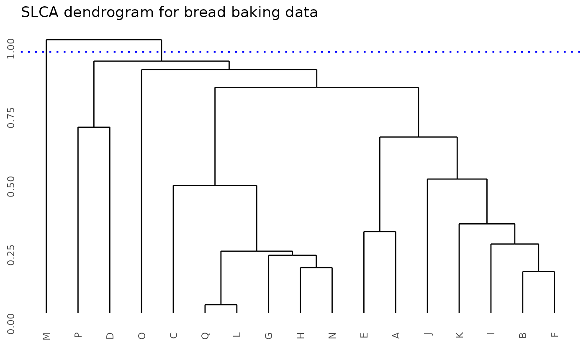

# Customizing Plots

## Customizing dendrograms

 🇬🇧 Dendrograms can be customized, using any argument available for the
[`plot()`](https://rdrr.io/r/graphics/plot.default.html) function. In
the following example, multiple aspects of the figure are modified,
including labels, axes and colors.

 🇪🇸 Los dendrogramas pueden ser personalizados, utilizando cualquier
argumento disponible para la función
[`plot()`](https://rdrr.io/r/graphics/plot.default.html). En el
siguiente ejemplo, se modifican diversos aspectos de la figura,
incluyendo etiquetas, ejes y colores.

``` r
library(ClustMC)

data(clover)

bss_test(
  y = clover$nitrogen, trt = clover$treatment, console = FALSE,
  main = "A customized plot", xlab = "Treatments", ylab = NULL, col = "grey50",
  cex = 0.75, axes = FALSE, frame.plot = TRUE
)
```


## Customizing lines

 🇬🇧 Straight lines are created with the
[`abline()`](https://rdrr.io/r/graphics/abline.html) function and their
appearance can also be customized. In this case, a
[`list()`](https://rdrr.io/r/base/list.html) must be passed as an
argument. The list should contain the desired arguments and values for
[`abline()`](https://rdrr.io/r/graphics/abline.html). An example is
provided below:

 🇪🇸 Las líneas rectas son creadas con la función
[`abline()`](https://rdrr.io/r/graphics/abline.html) y su apariencia
también puede ser personalizada. En este caso, se deberá proveer como
argumento un objeto de tipo
[`list()`](https://rdrr.io/r/base/list.html). Este objeto debe contener
los argumentos y valores deseados para
[`abline()`](https://rdrr.io/r/graphics/abline.html). A continuación se
muestra un ejemplo:

``` r
library(ClustMC)

data(PlantGrowth)
plants_weights <- PlantGrowth$weight
plants_trt <- PlantGrowth$group

dgc_test(
  y = plants_weights, trt = plants_trt, console = FALSE,
  main = "A plot with a customized line",
  abline_options = list(col = "red", lty = 3, lwd = 1)
)
```


## Using other packages

 🇬🇧 Alternatively, the `hclust` object, which the functions use to create
the dendrogram, is provided to the user, enabling the use of different
libraries. In the following example, the
[ggdendro](https://andrie.github.io/ggdendro/) package is used to plot
the dendrogram with ggplot2.

 🇪🇸 Como alternativa, el usuario tiene acceso al objeto de clase `hclust`
usado por las funciones para crear el dendrograma, lo cual permite la
aplicación de diversos paquetes. En el siguiente ejemplo se recurre al
paquete [ggdendro](https://andrie.github.io/ggdendro/) para graficar el
dendrograma con ggplot2.

``` r
library(ClustMC)
library(ggplot2)
library(ggdendro)

data(bread)
anova_model <- aov(volume ~ variety + as.factor(bromate), data = bread)

test_results <- jolliffe_test(
  y = anova_model, trt = "variety", console = FALSE,
  show_plot = FALSE
)

ggdendro::ggdendrogram(test_results$dendrogram_data) +
  ggplot2::geom_hline(
    yintercept = 0.95, colour = "blue", linetype = "dotted",
    linewidth = 0.75
  ) +
  ggplot2::ggtitle("SLCA dendrogram for bread baking data")
```


